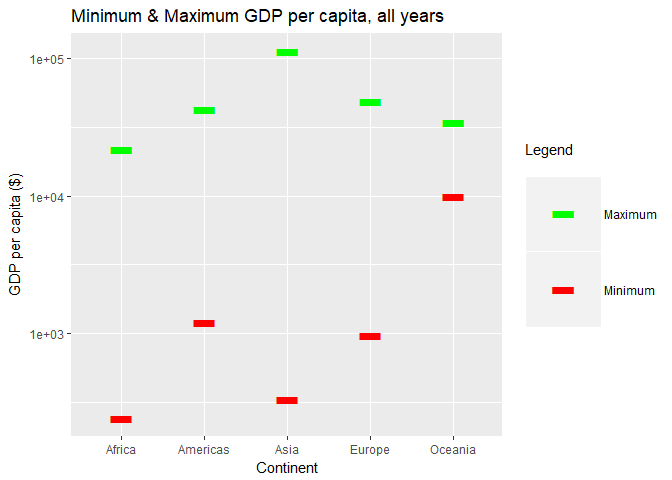

hw03-gapminder
================

Using dplyr, ggplot2 to explore data
====================================

Initialize the data
-------------------

-   Load the gapminder and tidyverse libraries:

``` r
suppressPackageStartupMessages(library(tidyverse))
suppressPackageStartupMessages(library(gapminder))
```

-   Take a snapshot of the data to *sanity check* that the data and variables appear as we expect:

``` r
(head(gapminder))
```

    ## # A tibble: 6 x 6
    ##   country     continent  year lifeExp      pop gdpPercap
    ##   <fct>       <fct>     <int>   <dbl>    <int>     <dbl>
    ## 1 Afghanistan Asia       1952    28.8  8425333      779.
    ## 2 Afghanistan Asia       1957    30.3  9240934      821.
    ## 3 Afghanistan Asia       1962    32.0 10267083      853.
    ## 4 Afghanistan Asia       1967    34.0 11537966      836.
    ## 5 Afghanistan Asia       1972    36.1 13079460      740.
    ## 6 Afghanistan Asia       1977    38.4 14880372      786.

*Observations:* *Using the suppress messages command from cm008 blocks the library loading message from outputting.*

Task 1
------

**Task:** Get the max and min GDP per capita for all continents

1.  Filter the data by continent
2.  Select the GDP per capita
3.  Find the minimum and maximum values by: (i) analyzing the range; (ii) querying the min and max directly
4.  Present the data in a table
5.  Visualize the data in a graph
6.  Interpret the data \*Why would we want to look at the max and min GDP per capita for each continent?

<!-- -->

1.  Imagine we want to look at the distribution of min values and max values respectively to see if they are normal distributions.
2.  Perhaps we want to see the average min GDP and the average max GDP. Or find the countries with the biggest gap between min and max values, respectively, Or the widest range between min and max values. *Reflections:* *Finding the min and max directly is useful if you need to assign the values to individual variables, but using the range() command allows you to see both values faster with a single command. Both methods are used here because their redundancy permits error checking.* *I used Stack Overflow for some ideas* *Other resources: <https://www.math.ucla.edu/~anderson/rw1001/library/base/html/merge.html>; <https://www.sixhat.net/how-to-plot-multpile-data-series-with-ggplot.html>; <https://stackoverflow.com/questions/23635662/editing-legend-text-labels-in-ggplot*> *Might be more realistic to look only at a particular year, using filter()* *Make observations about spread, range, thresholds)* *Used a bar instead of a bar, since this feels like a more natural symbol choice for a upper and lower limit\*

``` r
# Select the necessary data and group to reduce the size; Find the max and min values per continent
min_gdp <- select(gapminder, continent, gdpPercap) %>% 
  group_by(continent) %>% 
    summarize(min_gdpPercap = min(gdpPercap))

max_gdp <- select(gapminder, continent, gdpPercap) %>% 
  group_by(continent) %>% 
    summarize(max_gdpPercap = max(gdpPercap))

#Merge data into a single table
(min_max_gdp <- merge(min_gdp, max_gdp, by.x = "continent"))
```

    ##   continent min_gdpPercap max_gdpPercap
    ## 1    Africa      241.1659      21951.21
    ## 2  Americas     1201.6372      42951.65
    ## 3      Asia      331.0000     113523.13
    ## 4    Europe      973.5332      49357.19
    ## 5   Oceania    10039.5956      34435.37

``` r
#Sanity check the value
str(min_max_gdp)
```

    ## 'data.frame':    5 obs. of  3 variables:
    ##  $ continent    : Factor w/ 5 levels "Africa","Americas",..: 1 2 3 4 5
    ##  $ min_gdpPercap: num  241 1202 331 974 10040
    ##  $ max_gdpPercap: num  21951 42952 113523 49357 34435

``` r
(range(gapminder$gdpPercap))
```

    ## [1]    241.1659 113523.1329

``` r
#Visualize the data in a graph
ggplot(min_max_gdp, aes(x = continent, y = value, color = variable)) +
  geom_point(aes(y = min_gdpPercap, col = "min_gdpPercap"), size=20, shape = "-") +
  geom_point(aes(y = max_gdpPercap, col = "max_gdpPercap"), size=20, shape = "-") +
  #Change y-axis to log-scale given the wide range in values
  #scale_y_log10() +
  #Add labels
  labs(title = "Minimum & Maximum GDP per capita, over all years",
  x = "Continent", y = "GDP per capita ($)", color = "Legend\n") +
  scale_color_manual(labels = c("Maximum", "Minimum"), values = c("green", "red"))
```



``` r
#increase point size
```

Task 2
------

**Task:** Look at the spread of GDP per capita within the continents

1.  Filter the data by continent
2.  Select the GDP per capita
3.  Find the minimum and maximum values by: (i) analyzing the range; (ii) querying the min and max directly
4.  Present the data in a table
5.  Visualize the data in a graph
6.  Interpret the data

<!-- -->

1.  Say we want to compare the relative ranges. We could compare just the min and max, but we will get a more complete picture by looking at the distribution.
2.  Perhaps we want to know which continent has the widest spread? Narrowest spread?
3.  *Reflections:*

Task 3
------

**Task:** Compute a trimmed mean of life expectancy for different years. Or a weighted mean, weighting by population. Just try something other than the plain vanilla mean.

1.  Filter the data by continent
2.  Select the GDP per capita
3.  Find the minimum and maximum values by: (i) analyzing the range; (ii) querying the min and max directly
4.  Present the data in a table
5.  Visualize the data in a graph
6.  Interpret the data *Reflections:*

Task 4
------

**Task:** How is life expectancy changing over time on different continents?

1.  Filter the data by continent
2.  Select the GDP per capita
3.  Find the minimum and maximum values by: (i) analyzing the range; (ii) querying the min and max directly
4.  Present the data in a table
5.  Visualize the data in a graph
6.  Interpret the data *Reflections:*
