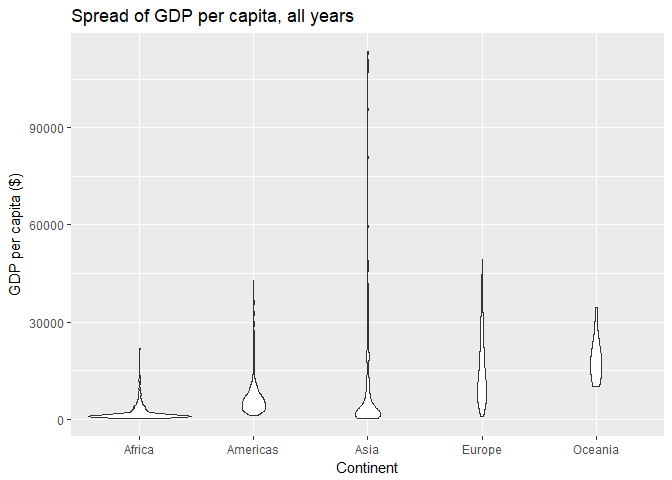
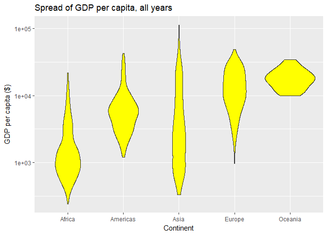
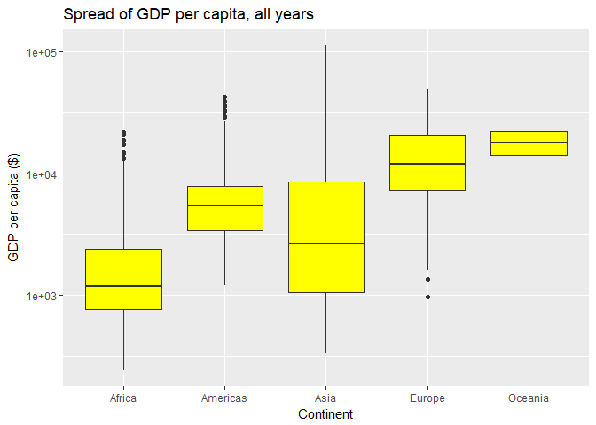
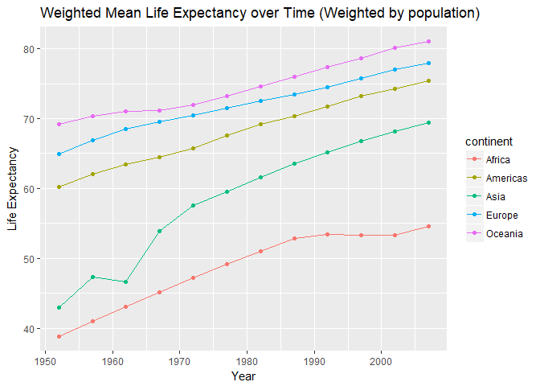
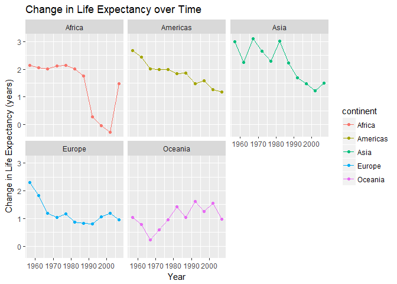

hw03-gapminder
================

Using dplyr, ggplot2 to explore data
====================================

Initialize the data
-------------------

-   Load the gapminder, tidyverse and knitr libraries:

``` r
suppressPackageStartupMessages(library(tidyverse))
suppressPackageStartupMessages(library(gapminder))
suppressPackageStartupMessages(library(knitr))
```

-   The knitr library is useful for improving the appearance of tables using the kable() command, described in more detail [here](https://www.rdocumentation.org/packages/knitr/versions/1.20/topics/kable).
-   We will take a quick look at the data to *sanity check* that the data and variables appear as we expect:

``` r
(head(gapminder))
```

    ## # A tibble: 6 x 6
    ##   country     continent  year lifeExp      pop gdpPercap
    ##   <fct>       <fct>     <int>   <dbl>    <int>     <dbl>
    ## 1 Afghanistan Asia       1952    28.8  8425333      779.
    ## 2 Afghanistan Asia       1957    30.3  9240934      821.
    ## 3 Afghanistan Asia       1962    32.0 10267083      853.
    ## 4 Afghanistan Asia       1967    34.0 11537966      836.
    ## 5 Afghanistan Asia       1972    36.1 13079460      740.
    ## 6 Afghanistan Asia       1977    38.4 14880372      786.

-   Everything looks as expected, so let's start exploring the data

Task 1
------

*Get the max and min GDP per capita for all continents.*

### Method

-   Reduce the data subset using select and group\_by
-   Find the minimum and maximum values

### Table

``` r
#Find the min
min_gdp <- select(gapminder, continent, gdpPercap) %>% 
  group_by(continent) %>% 
    summarize(min_gdp = min(gdpPercap))
#Find the max
max_gdp <- select(gapminder, continent, gdpPercap) %>%
 group_by(continent) %>%
   summarize(max_gdp = max(gdpPercap))
#Merge data into a single table
min_max_gdp <- merge(min_gdp, max_gdp, by.x = "continent")
kable(min_max_gdp)
```

| continent |    min\_gdp|   max\_gdp|
|:----------|-----------:|----------:|
| Africa    |    241.1659|   21951.21|
| Americas  |   1201.6372|   42951.65|
| Asia      |    331.0000|  113523.13|
| Europe    |    973.5332|   49357.19|
| Oceania   |  10039.5956|   34435.37|

``` r
#Sanity check the values
str(min_max_gdp)
```

    ## 'data.frame':    5 obs. of  3 variables:
    ##  $ continent: Factor w/ 5 levels "Africa","Americas",..: 1 2 3 4 5
    ##  $ min_gdp  : num  241 1202 331 974 10040
    ##  $ max_gdp  : num  21951 42952 113523 49357 34435

``` r
(range(gapminder$gdpPercap))
```

    ## [1]    241.1659 113523.1329

### Plot

``` r
ggplot(min_max_gdp, aes(x = continent, y = value, color = variable)) +
  geom_point(aes(y = min_gdp, col = "min_gdp"), size=20, shape = "-") +
  geom_point(aes(y = max_gdp, col = "max_gdp"), size=20, shape = "-") +
  #Change y-axis to log-scale given the wide range in values
  scale_y_log10() +
  #Add labels
  labs(title = "Minimum & Maximum GDP per capita, all years",
  x = "Continent", y = "GDP per capita ($)", color = "Legend\n") +
  scale_color_manual(labels = c("Maximum", "Minimum"), values = c("green", "red"))
```



### Observations & Analysis

-   We see that the minimum GDP per capita for Oceania is significantly higher than the other continents. Africa and Asia both have very low GDP per capita relative to the other continents. The widest range in GDP per capita is observed in Asia, while the smallest range is observed in Oceania.
-   It's challenging to imagine a practical use for the data in this form (i.e. with all years of data present). I feel it would be more likely to determine the min and max values of GDP for a particular year (i.e. using filter()).
-   I chose to use a line to represent the limit values because I felt that this symbol is a more appropriate indicator of an upper and lower limit than a point.
-   Representing the min and max values only may offer a simplified view of the data for applications where the complete spread is not necessary or overly complex.

Task 2
------

*Look at the spread of GDP per capita within the continents.*

### Method

-   Reduce the data subset using select() and group\_by()
-   Find the key indicators of spread (i.e. mean, variance, etc.)

### Table

``` r
gapminder %>% 
  select(continent, gdpPercap) %>% 
  group_by(continent) %>% 
    summarize(Mean=mean(gdpPercap), Median = median(gdpPercap), SD=sd(gdpPercap), Var=var(gdpPercap)) %>% 
     kable()
```

| continent |       Mean|     Median|         SD|        Var|
|:----------|----------:|----------:|----------:|----------:|
| Africa    |   2193.755|   1192.138|   2827.930|    7997187|
| Americas  |   7136.110|   5465.510|   6396.764|   40918591|
| Asia      |   7902.150|   2646.787|  14045.373|  197272506|
| Europe    |  14469.476|  12081.749|   9355.213|   87520020|
| Oceania   |  18621.609|  17983.304|   6358.983|   40436669|

### Plots

``` r
#Visualize the data in a graph (violin plot)
gapminder %>% 
  select(continent, gdpPercap) %>% 
  group_by(continent) %>% 
    ggplot(aes(continent, gdpPercap)) +
    #Change y-axis to log-scale given the wide range in values
    scale_y_log10() +
    geom_violin(fill = "yellow") +
  #Add labels
  labs(title = "Spread of GDP per capita, all years",
  x = "Continent", y = "GDP per capita ($)")
```



``` r
#Visualize the data in a graph (box plot)
gapminder %>% 
  select(continent, gdpPercap) %>% 
  group_by(continent) %>% 
    ggplot(aes(continent, gdpPercap)) +
    #Change y-axis to log-scale given the wide range in values
     scale_y_log10() +
    geom_boxplot(fill = "yellow") +
  #Add labels
  labs(title = "Spread of GDP per capita, all years",
  x = "Continent", y = "GDP per capita ($)")
```



### Observations & Analysis

-   The data shown in Task 2 is a more thorough evaluation of the data from Task 1. The same observations are apparent rom Task 1, but we can make additional observations of the spread of the data within the upper and lower limits. For example, we observe that the spread for Asia has very long whisker quantiles. Comparatively, the spread for Oceania is approximately even between all quantiles.
-   The highest mean GDP per capita, in descending order, is: Oceania, Europe, Americas, Asia, Africa.
-   Generally, the table format is more useful for reading exact numbers, while the plot is useful for quickly spotting trends.
-   Another way to analyze the data would be through using a facet\_wrap() to separate the plots for each continent.

Task 3
------

*Compute a trimmed mean of life expectancy for different years. Or a weighted mean, weighting by population. Just try something other than the plain vanilla mean.*

### Method

-   Reduce the data subset using select() and group\_by()
-   Compare the traditional mean, weighted mean by population and trimmed mean (trimming 5 values on either end of the data)
-   Examine one type of mean in further detail

### Tables

-   First, we will compare the mean life expectancy, as calculated using different types of means, over only the 1980s, in order to make the output simpler:

``` r
(mean_comp <- gapminder) %>% 
  select(year, continent, lifeExp, pop) %>% 
    filter(year >1980 & year <1990) %>% 
      group_by(year, continent) %>% 
       summarize(mean_lifeExp = mean(lifeExp), w_mean_lifeExp = weighted.mean(lifeExp, pop), t_mean_lifeExp = mean(lifeExp, trim = 0.3)) %>% 
        kable()
```

|  year| continent |  mean\_lifeExp|  w\_mean\_lifeExp|  t\_mean\_lifeExp|
|-----:|:----------|--------------:|-----------------:|-----------------:|
|  1982| Africa    |       51.59287|          51.01744|          51.10986|
|  1982| Americas  |       66.22884|          69.19264|          67.33682|
|  1982| Asia      |       62.61794|          61.57472|          63.42100|
|  1982| Europe    |       72.80640|          72.56247|          73.13033|
|  1982| Oceania   |       74.29000|          74.58291|          74.29000|
|  1987| Africa    |       53.34479|          52.82479|          52.59827|
|  1987| Americas  |       68.09072|          70.35814|          68.81500|
|  1987| Asia      |       64.85118|          63.53710|          65.93267|
|  1987| Europe    |       73.64217|          73.44717|          74.07408|
|  1987| Oceania   |       75.32000|          75.98107|          75.32000|

-   We observe from the data above that there is a small value difference between the different types of means
-   For the next analysis, we will only consider the weighted mean (for simplicity), but we will now consider all years:

``` r
w_mean <- gapminder %>%
  group_by(year,continent) %>%
   summarize(w_mean = weighted.mean(lifeExp, pop))

spread_w_mean <- spread(w_mean, key = "year", value = "w_mean")
kable(spread_w_mean)
```

| continent |      1952|      1957|      1962|      1967|      1972|      1977|      1982|      1987|      1992|      1997|      2002|      2007|
|:----------|---------:|---------:|---------:|---------:|---------:|---------:|---------:|---------:|---------:|---------:|---------:|---------:|
| Africa    |  38.79973|  40.94031|  43.09925|  45.17721|  47.21229|  49.20883|  51.01744|  52.82479|  53.37292|  53.28327|  53.30314|  54.56441|
| Americas  |  60.23599|  62.01806|  63.43706|  64.50630|  65.70490|  67.60591|  69.19264|  70.35814|  71.72177|  73.19154|  74.24736|  75.35668|
| Asia      |  42.94114|  47.28835|  46.57369|  53.88261|  57.52159|  59.55648|  61.57472|  63.53710|  65.14874|  66.77092|  68.13732|  69.44386|
| Europe    |  64.90540|  66.89364|  68.45957|  69.54963|  70.46884|  71.53989|  72.56247|  73.44717|  74.44273|  75.70849|  77.02232|  77.89057|
| Oceania   |  69.17040|  70.31693|  70.98808|  71.17848|  71.92273|  73.25684|  74.58291|  75.98107|  77.35788|  78.61843|  80.16006|  81.06215|

### Plot

``` r
w_mean %>%
  ggplot(aes(year, w_mean)) +
  geom_point(aes(color = continent)) +
  geom_line(aes(color = continent)) +
  #Add labels
  labs(title = "Weighted Mean Life Expectancy over Time (Weighted by population)",
    x = "Year", y = "Life Expectancy")
```



### Observations & Analysis

-   From the data, we can observe that the life Expectancy for Africa is lower than the other continents for all years studied, while the life expectancy for Oceania is consistenly the highest among continents. The trend lines do not intersect, therefore the rank of life expectancy has not changed over this time period. Further, all continents have experienced an increase in life expectancy over the time evaluated. The only exception is a decrease in the life expectancy of Asia in 1963.
-   This task clearly shows that a plot can display significantly more data than a table. The first table was truncated to show only one decade worth of data in order to fit in a reasonable amount of space on the screen. The second table requires a scroll bar to view all of the data, so it is not easy to glimpse the data all at once. The graph shows the most information with the most clarity.

Task 4
------

*How is life expectancy changing over time on different continents?*

### Method

-   Reduce the data subset using select() and group\_by()
-   Compare the traditional mean, weighted mean by population and trimmed mean (trimming 5 values on either end of the data)
-   Examine one type of mean in further detail

### Table

``` r
del_lifeExp <- gapminder %>%
  group_by(continent) %>%
  #Add a column for change in life expectancy (Current - Previous)
  mutate(del_lifeExp = lifeExp - lag(lifeExp)) %>%
    group_by(year, continent) %>%
    summarize(mean_del = mean(del_lifeExp)) %>%
    #Remove NA from column
    na.omit()
  
lifeExp_stats <- spread(del_lifeExp, key="year", value="mean_del")
kable(lifeExp_stats)
```

| continent |      1957|      1962|      1967|      1972|      1977|       1982|       1987|       1992|        1997|        2002|      2007|
|:----------|---------:|---------:|---------:|---------:|---------:|----------:|----------:|----------:|-----------:|-----------:|---------:|
| Africa    |  2.130846|  2.053096|  2.015096|  2.116404|  2.129481|  2.0124423|  1.7519231|  0.2847885|  -0.0313077|  -0.2730385|  1.480808|
| Americas  |  2.680440|  2.438480|  2.012160|  1.984000|  1.996640|  1.8372800|  1.8618800|  1.4776400|   1.5821200|   1.2715600|  1.186080|
| Asia      |  3.004150|  2.244679|  3.100417|  2.655629|  2.291287|  3.0073830|  2.2332424|  1.6860303|   1.4833030|   1.2133636|  1.494606|
| Europe    |  2.294567|  1.836167|  1.198367|  1.037433|  1.162733|  0.8686333|  0.8357667|  0.7979333|   1.0650667|   1.1954333|  0.948000|
| Oceania   |  1.040000|  0.790000|  0.225000|  0.600000|  0.945000|  1.4350000|  1.0300000|  1.6250000|   1.2450000|   1.5500000|  0.979500|

### Plots

``` r
del_lifeExp %>%
  ggplot(aes(year, mean_del)) +
  facet_wrap( ~ continent) +
  geom_point(aes(color = continent)) +
  geom_line(method='lm', aes(color = continent)) +
  #Add labels
  labs(title = "Change in Life Expectancy over Time",
       x = "Year", y = "Change in Life Expectancy (years)") 
```

    ## Warning: Ignoring unknown parameters: method



### Observation & Analysis

-   We observe that the change in life expectancy has not changed by more than 3 years (year over year) for any continent, over the time period studied. Specific observations can also be made regarding each continent. For example, Africa has experienced a very minor change in life expectancy since 1990, which represents a significant drop from previous years.
-   Facetting is a useful way of separating data which may be too confusing if plotted all together on the same plot. Although I think the data would still be manageable to explore on one plot, I decided to use facetting in this example to show how the separation of plots allows for easier interpretation of data for each continent.

### Resources

<https://www.math.ucla.edu/~anderson/rw1001/library/base/html/merge.html> <https://www.sixhat.net/how-to-plot-multpile-data-series-with-ggplot.html> <https://stackoverflow.com/questions/23635662/editing-legend-text-labels-in-ggplot> <https://www.dummies.com/programming/r/how-to-check-quantiles-in-r/>
